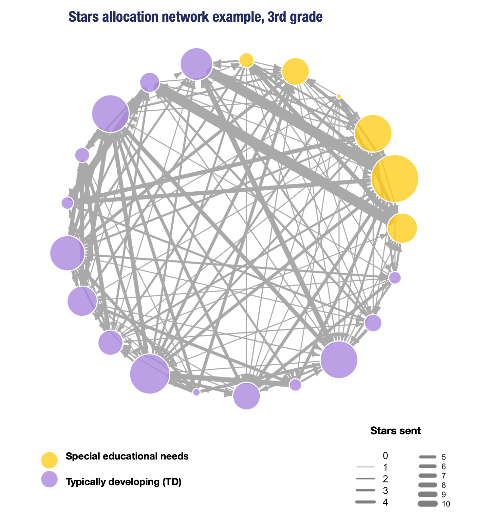

We employ Social Network Analysis to quantify patterns of interactions, the social structure of groups, and individual positions in these groups.

We constructed **two interaction networks** **for each classroom** in which students are nodes, and links are defined by their behavior in the game.

**Selection Network:**

-   Selection from participant A to B is a directed link.
-   We observe all choices for all players.
-   Centrality is total of received selections.

**Stars allocation Network:**

-   Is a subset conditional on selection.
-   Stars sent are weighted directed links.
-   Centrality is sum of received.

