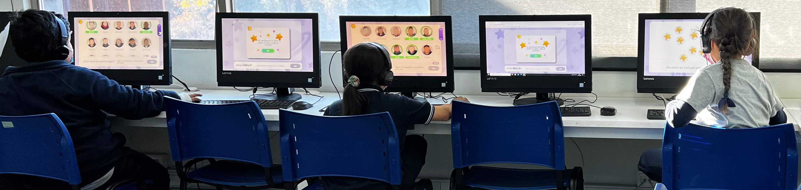
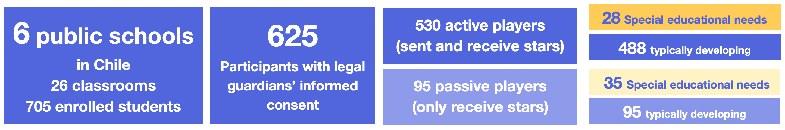

## Experimental desing

-   In our **experimental design** we implemented game theory to collect behavioral data that capture social interaction in an ecologically valid context.

-   We designed a computational interface in which participants played a **non anonymous dictator game adapted for young children with and without special educational needs.**

-   Instructions and interface is written and with audio instructions, allowing students that do not know how to read to play.

-   Students with special needs were accompanied by an special need specialist or teacher during the game, if needed.

-   The game duration is between 5 and 10 minutes.

    

## The Stars game

The game protocol is the following:

1.  Informed consent

2.  Earn 15 stars in a real effort task

3.  Choose 10 classmates to play

    

4.  Distribute 15 stars between 10 selected tokens

4\. Sociometric questionaries - We also asked participate to nominate:

-   Their friends

-   Who do you like or want to hang out

-   Who do you don't like or want to hang out

## Participants

