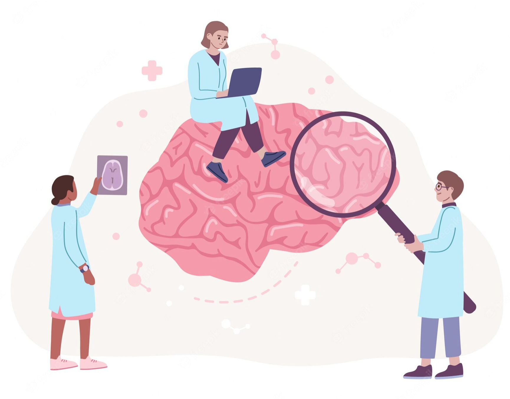

# Further work

The Stars project is the first stage of an interdisciplinary research that entails a Multilevel approach, i.e. , the group level analysis, the individual level analysis, and the brain level analysis.  Thus, the data collected in this first stage of the study allow us to build the social network of the classroom from which the second stage of the research is based. This second stage of the study analyzes the brain processing of the children of the first stage by means of electroencephalography (EEG) technique.  Therefore, the aim of the multilevel research is to estimate the relationship between the brain processing and the centrality and reciprocity measurements of the child.

Currently, the **NeuroSciences Team** is collecting the data of this second stage of the analysis in order to complete the sample by the end of the year. We expect to finish the full analysis during year 2023.

The new teammates involved in this part of the project are [María Paz Martínez](https://dccs.udd.cl/persona/maria-paz-martinez-molina-2/), [Victor Márquez](https://dccs.udd.cl/persona/victor-julio-marquez-2/) and [Mauricio Aspé](https://dccs.udd.cl/persona/mauricio-aspe-2/).

