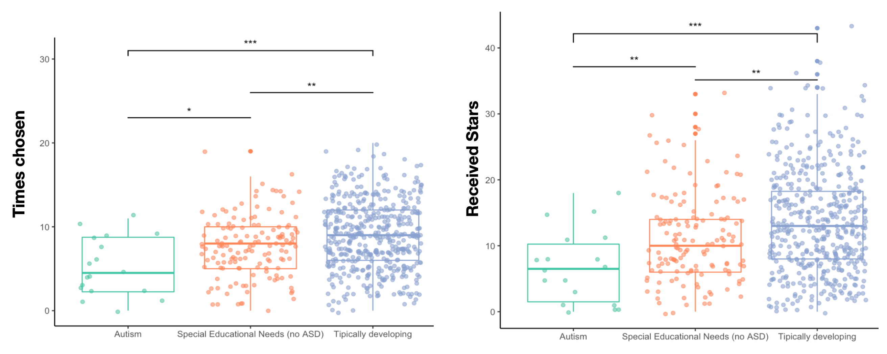
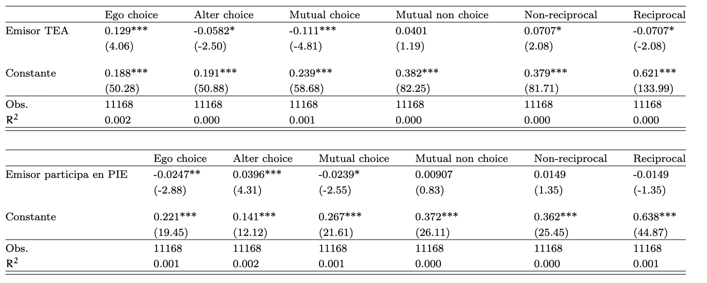

1.  Children with **special educational needs and autism have significantly lower centrality** compared to typically developing children.

    

All estimations presented at with classroom level fixed effects and clustered standar errors.

1.  Children with autism significantly **engage in less reciprocal relationships**, compared with typically developing children.

**Distribution of reciprocated choice:**

**Probability of reciprocated choice**

**Reciprocated Stars**

1.  **Contrary to the literature**, children with ADHD did not show any significant differences  to both TD children  and children with special educational needs, including autism. 

