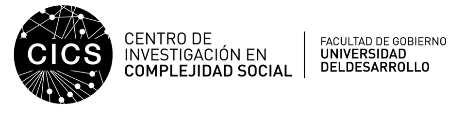

# Team

This Project is lead by [Patricia Soto-Icaza](https://dccs.udd.cl/persona/patricia-soto-icaza/) researcher at the Laboratory In Social Neurociences at The Research Center for Social Complexity (CICS *in spanish*), Facultad de Gobierno, Universidad del Desarrollo.

This project is the joint effort from different collaborators [Tamara Yaikin](https://dccs.udd.cl/persona/claudia-fernandino-bonino-2/), [Mirla Arcos](https://www.researchgate.net/profile/Mirla-Arcos-Polanco), [Cristian Candia](https://linktr.ee/crcandiav), [Carlos Rodríguez-Sickert](https://dccs.udd.cl/persona/carlos-rodriguez-sickert-2/) , and [Pablo Billeke](https://dccs.udd.cl/persona/pablo-billeke-2/) and myself, Melanie Oyarzun, Phd. Candidate in Social Compleixty Sciences.

# Collaborators

This project would'nt be possible without the collaboration of:

-   [NieblaGames](https://www.nieblagames.com)

-   [INVADELAB](https://invadelab.cl)

-   [Fundación Incluir Tarea de Todos](https://www.incluirtareadetodos.cl)

# Funding

The project is funded by the Chilean National Agency of Research and Development (in spanish, ANID -Agencia Nacional de Investigación y Desarrollo) PAI project folio 7719004.

