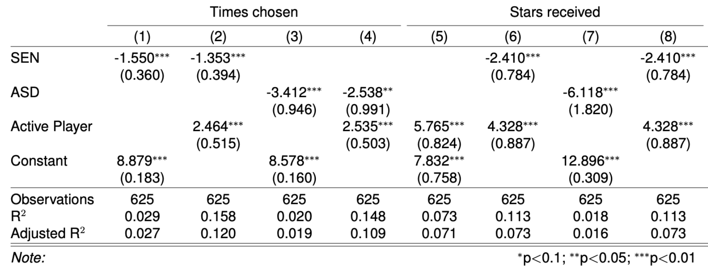

## Key findings:

1.  Children with **special educational needs and autism have significantly lower centrality** compared to typically developing children.

    

2.  Children with autism significantly **engage in less reciprocal relationships**, compared with typically developing children.

    

3.  **Contrary to the literature**, children with ADHD did not show any significant differences  to both TD children  and children with special educational needs, including autism. 
